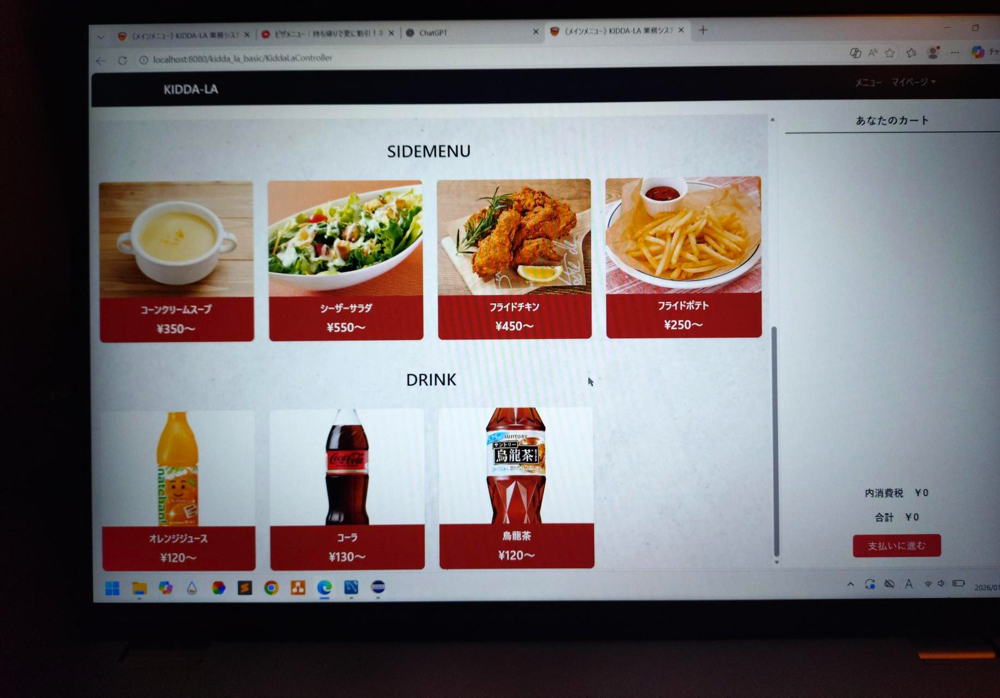

# pizza-order-webapp
Java(Servlet/JSP)で作成したピザ注文Webアプリ

## 概要
 
本アプリは、ユーザーがブラウザからピザを注文できるWebアプリケーションです。

従来は店舗注文の電話対応向けの社内アプリの実装でしたが、一般ユーザーが直接注文できる仕組みにすることで、
利便性の向上を目指しました。

注文処理、カート管理、画面遷移の最適化などを通じて、
ユーザー体験を意識した設計・実装を行っています。

## 技術構成

フロントエンド：JSP,HTML,CSS

バックエンド：Java(Servlet)

データベース：MySQL

## 機能一覧
- ユーザー認証
  - 新規会員登録
  - ログイン機能（パスワードのハッシュ化対応）
  - ユーザー識別にUUIDを使用

- メニュー機能
  - ピザメニュー一覧表示
  - 商品詳細表示

- キャンペーン機能
  - キャンペーン一覧表示

- 注文機能
  - カート追加・削除・数量変更
  - 注文確定処理

## 担当範囲

### DAO

- `src/main/java/dao/GetImageDBAcess.java`
- `src/main/java/dao/GetImage_CampaignDBAccess.java`
- `src/main/java/dao/ItemDAO.java`
- `src/main/java/dao/ItemMenuDisplayDBAccess.java`
- `src/main/java/dao/SearchAllMenuDBAccess.java`
- `src/main/java/dao/Campaign_DesignListDBAccess.java`

### Control

- `src/main/java/control/ImageServlet.java`
- `src/main/java/control/ImageServlet_campaign.java`
- `src/main/java/control/SizeServlet.java`

### Action

- `src/main/java/action/Campaign_DesignAction.java`
- `src/main/java/action/ItemMenuDisplayAction.java`
- `src/main/java/action/SearchAllMenuAction.java`

### Modal

- `src/main/java/model/Campaign.java`
- `src/main/java/model/Item.java`

### JSP

- `src/main/webapp/HomePage.jsp`
- `src/main/webapp/campaign.jsp`

### その他

DB構築

## 画像

本アプリは学校の貸与PCで開発を行っていたため、
開発環境を現在は保持しておらず、実際の画面キャプチャは残っていません。

そのため、掲載している画像は開発当時に撮影した参考用の写真となります。

.jpg)

.jpg)

※これらの画像の作品は学習目的であり、商用利用を目的としたものではありません。
